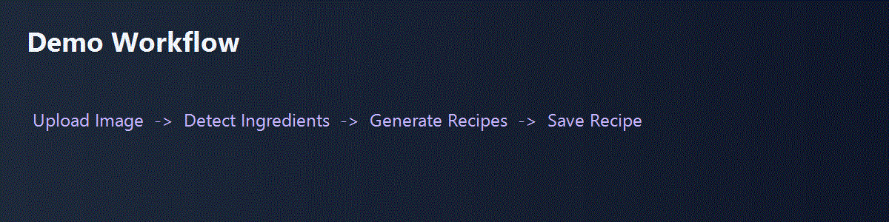
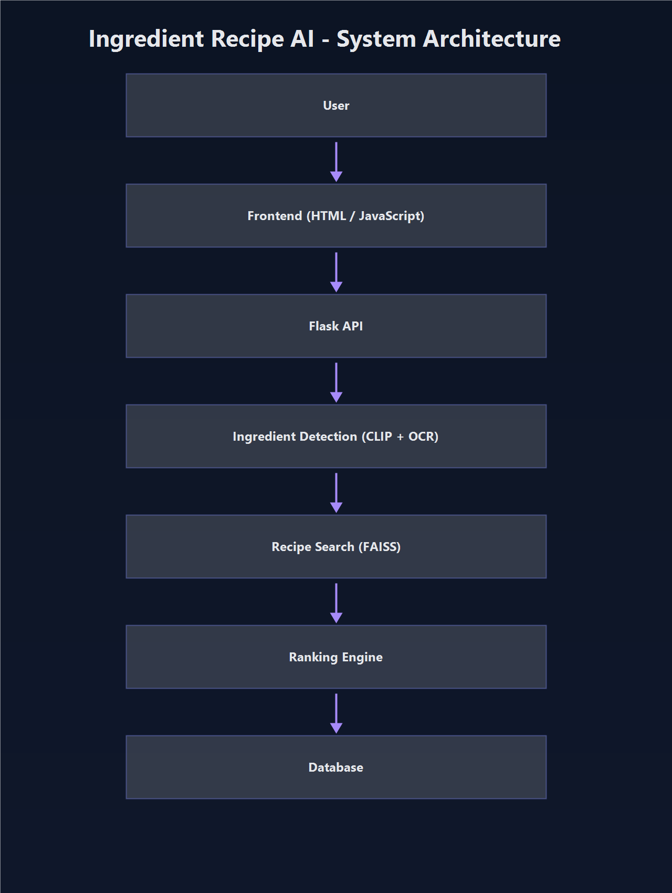
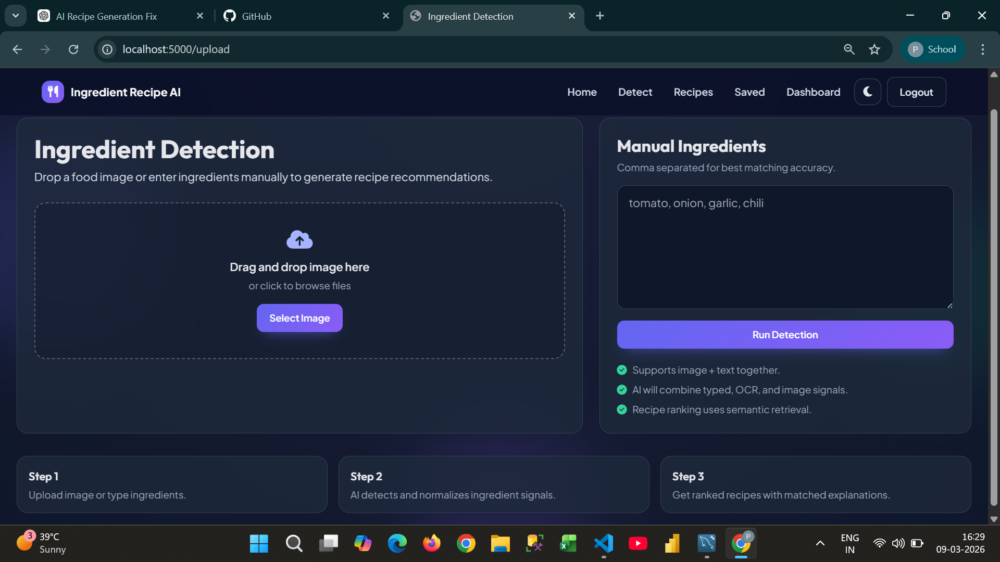
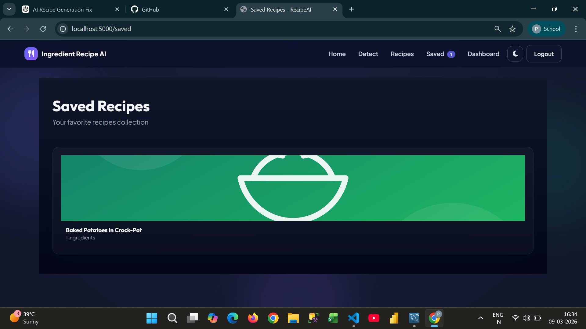
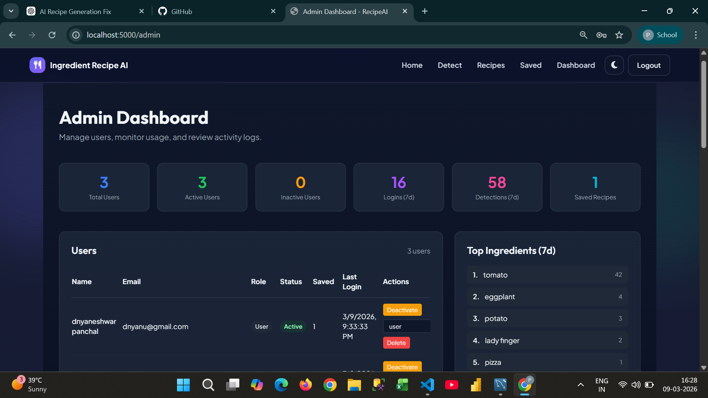

# Ingredient Recipe AI


AI-powered recipe recommendation platform that detects ingredients from image and text input, then returns ranked recipes with explainable matching and save/history support.

## Demo



## Architecture



Flow:

User -> Frontend (HTML / JavaScript) -> Flask API -> Ingredient Detection (CLIP + OCR) -> Recipe Search (FAISS) -> Ranking Engine -> Database

## Key Features

- Ingredient detection from uploaded image + manual ingredient input
- OCR-based ingredient extraction and cleanup
- Semantic recipe retrieval using embeddings + FAISS
- Hybrid ranking with ingredient coverage and relevance signals
- Save/unsave recipes and dashboard tracking
- Admin monitoring endpoints and analytics

## Tech Stack

- Backend: Flask, SQLAlchemy, Flask-Migrate, PyMySQL
- AI/ML: CLIP, OCR (Tesseract/OpenCV), SentenceTransformers, FAISS
- Frontend: Jinja templates, Tailwind CSS, Vanilla JavaScript
- Testing: pytest, pytest-cov

## Project Structure

```text
ingredient_recipe_ai/

|
|- backend/
|  |- app/
|  |  |- routes/
|  |  |- services/
|  |  |- ml/
|  |  |- models/
|  |  |- utils/
|  |  `- config.py
|  |
|  |- migrations/
|  |- tests/
|  `- run.py
|
|- frontend/
|  |- templates/
|  `- static/
|
|- dataset/
|  `- recipes/
|
|- docs/
|  |- screenshots/
|  `- architecture.png
|
|- README.md
|- requirements.txt
`- .gitignore
```

## Installation

1. Clone repository

```bash
git clone <your-repo-url>
cd ingredient_recipe_ai
```

2. Install dependencies

```bash
pip install -r requirements.txt
pip install -r requirements-dev.txt
```

3. Configure environment

```bash
cp .env.example .env
```

4. Run migrations

```bash
make migrate
```

5. Start application

```bash
make run
```

## Development Commands

```bash
make run      # Start Flask app
make test     # Run tests with coverage
make migrate  # Apply DB migrations
make format   # Format backend code with black
```

## Screenshots

### Ingredient Detection Page



### Recipe Results Page


### Save Recipe Feature



### Admin Dashboard



## AI Models

- CLIP (`openai/clip-vit-base-patch32`) for ingredient visual understanding
- OCR pipeline for text extraction and normalization
- SentenceTransformer embeddings (`all-MiniLM-L6-v2`) for semantic recipe matching
- FAISS index for fast nearest-neighbor recipe retrieval

## Dataset

- `dataset/recipes/` for recipe sources and processed recipe data
- Precomputed embedding/index artifacts available under `dataset/`
- Large model files are excluded from source control and can be downloaded if missing

## Future Improvements

- CI workflow for automated lint/test/coverage publishing
- Better cache strategy for model and recipe image retrieval
- Pagination and richer filters on saved/admin pages
- Optional JWT-only API mode for external clients

## License

This project is licensed under the MIT License. See [LICENSE](LICENSE).
